# ServidorDHCP

Pràctica d'instal·lació i configuració d'un servidor DHCP amb **Kea** a **Ubuntu Server**, amb un client **Zorin OS** i anàlisi del trànsit amb **Wireshark**.

- **Alumne:** Toni Correa
- **Número de llista (x):** 7 → xarxa **192.169.7.0/24**

## Índex

1. [Esquema de la pràctica](#1-esquema-de-la-pràctica)
2. [Preparació de les màquines a VirtualBox](#2-preparació-de-les-màquines-a-virtualbox)
3. [Configuració de xarxa del servidor](#3-configuració-de-xarxa-del-servidor)
4. [Instal·lació de Kea i desactivació de DHCPv6 i DDNS](#4-installació-de-kea-i-desactivació-de-dhcpv6-i-ddns)
5. [Configuració de l'arxiu kea-dhcp4.conf](#5-configuració-de-larxiu-kea-dhcp4conf)
6. [Comprovació de la sintaxi i arrencada del servei](#6-comprovació-de-la-sintaxi-i-arrencada-del-servei)
7. [Wireshark al client](#7-wireshark-al-client)
8. [Captura de la negociació DHCP](#8-captura-de-la-negociació-dhcp)
9. [Anàlisi dels paquets: broadcast i unicast](#9-anàlisi-dels-paquets-broadcast-i-unicast)
10. [Comprovació del client](#10-comprovació-del-client)
11. [Concessions del servidor](#11-concessions-del-servidor)
12. [Reserva d'una IP per al client](#12-reserva-duna-ip-per-al-client)
13. [Conclusions](#13-conclusions)

---

## 1. Esquema de la pràctica

| Màquina | Interfície | Mode a VirtualBox | Adreça |
|---|---|---|---|
| Ubuntu Server (`srv-smx01`) | `enp0s3` | NAT | DHCP de VirtualBox (accés a Internet) |
| Ubuntu Server (`srv-smx01`) | `enp0s8` | Xarxa interna `Internet` | **192.169.7.1/24** (estàtica) |
| Zorin (`fxsty-VirtualBox`) | `enp0s3` | NAT → Xarxa interna `Internet` | Rebuda per DHCP |

Paràmetres que reparteix el servidor DHCP:

| Paràmetre | Valor |
|---|---|
| Subxarxa | 192.169.7.0/24 |
| Pool | 192.169.7.10 – 192.169.7.50 |
| Porta d'enllaç | 192.169.7.254 |
| DNS | 8.8.8.8 |
| Reserva | 192.169.7.55 per a la MAC `08:00:27:a8:06:a5` (Zorin) |

---

## 2. Preparació de les màquines a VirtualBox

El servidor necessita dues interfícies: la primera en **NAT**, que li dona accés a Internet, i la segona en **Xarxa interna**, que és per on donarà el servei DHCP.

**Adaptador 1 del servidor en NAT:**

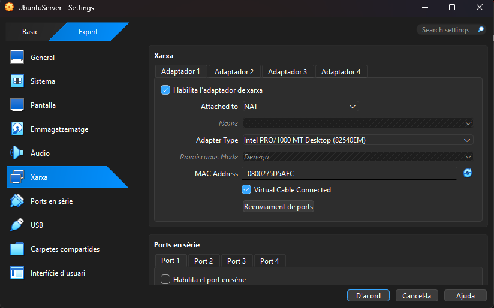

**Adaptador 2 del servidor en Xarxa interna**, amb el nom `Internet`. El client haurà de fer servir exactament el mateix nom per estar a la mateixa xarxa:

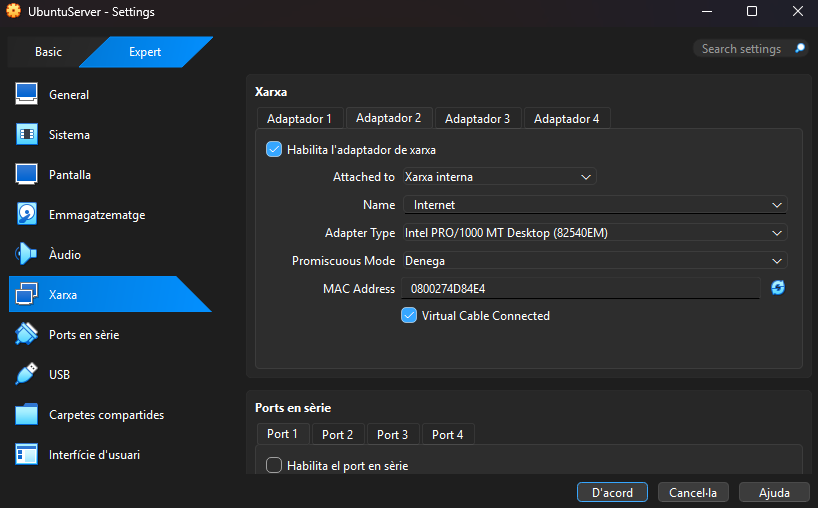

El **Zorin** comença amb l'adaptador en **NAT**, per poder instal·lar Wireshark des d'Internet. Més endavant es canviarà a Xarxa interna:

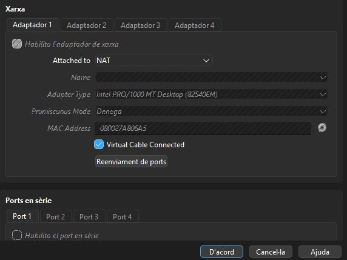

---

## 3. Configuració de xarxa del servidor

La xarxa es configura amb **netplan** (`/etc/netplan/50-cloud-init.yaml`):

- `enp0s3` (NAT) rep la IP per DHCP.
- `enp0s8` (xarxa interna) té la IP estàtica **192.169.7.1/24**, **sense porta d'enllaç ni servidor de noms**, tal com demana l'enunciat.

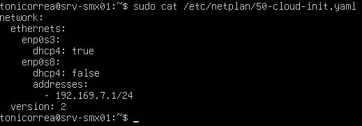

S'apliquen els canvis amb `sudo netplan apply` i es comprova amb `ip a` que la interfície `enp0s8` té la IP 192.169.7.1:

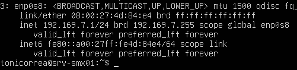

---

## 4. Instal·lació de Kea i desactivació de DHCPv6 i DDNS

S'instal·la Kea:

```bash
sudo apt update
sudo apt install kea
```

El paquet instal·la diversos serveis: el servidor DHCPv4, el DHCPv6, el DDNS i l'agent de control. En aquesta pràctica només es fa servir el **DHCPv4**, així que cal desactivar el **DHCPv6** i el **DDNS**.

A la presentació s'indica que es faci a l'arxiu `keactrl.conf`, però a Ubuntu **aquest arxiu no existeix**, perquè els serveis de Kea es gestionen amb **systemd**. Per això s'aturen i es desactiven amb `systemctl`:

```bash
sudo systemctl disable --now kea-dhcp6-server
sudo systemctl disable --now kea-dhcp-ddns-server
```

Es comprova que els dos serveis han quedat desactivats (`disabled`) i aturats (`inactive`):

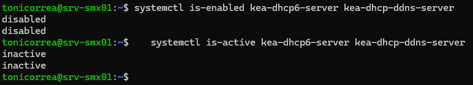

---

## 5. Configuració de l'arxiu kea-dhcp4.conf

Primer es canvia el nom de l'arxiu original per no perdre'l i poder consultar-lo com a exemple. Després se'n crea un de nou:

```bash
cd /etc/kea
sudo mv kea-dhcp4.conf old-kea-dhcp4.conf
sudo nano kea-dhcp4.conf
```

Contingut de l'arxiu nou:

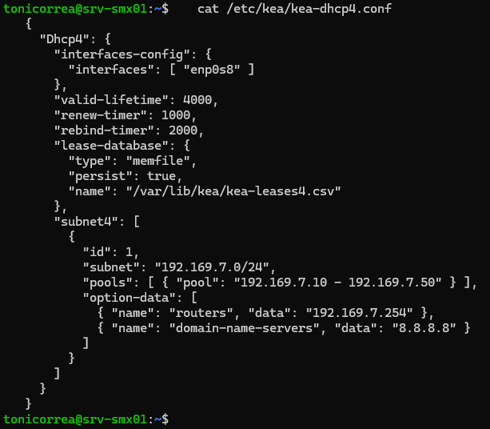

Explicació de cada part:

| Paràmetre | Per a què serveix |
|---|---|
| `interfaces-config` | Interfície per on escolta el servidor: `enp0s8`, la de la xarxa interna. |
| `valid-lifetime` | Durada de la concessió: 4000 segons. |
| `renew-timer` | Als 1000 segons el client intenta renovar la concessió amb el mateix servidor. |
| `rebind-timer` | Als 2000 segons, si el servidor no ha contestat al renew, el client demana la renovació a qualsevol servidor. |
| `lease-database` | Les concessions es guarden en un arxiu (`memfile`) de manera persistent, a `/var/lib/kea/kea-leases4.csv`. |
| `subnet4` → `id` | Identificador de la subxarxa. Les versions noves de Kea el demanen; si no es posa, surt un avís. |
| `subnet4` → `subnet` | La subxarxa de treball: 192.169.7.0/24. |
| `pools` | Rang d'adreces que es reparteixen: de la .10 a la .50. |
| `option-data` → `routers` | Porta d'enllaç que s'envia al client: 192.169.7.254. |
| `option-data` → `domain-name-servers` | Servidor DNS que s'envia al client: 8.8.8.8. |

Com que és un arxiu **JSON** cal fixar-se bé en el format: els blocs van entre `{ }`, les llistes entre `[ ]`, els elements se separen amb comes i l'últim element d'un bloc **no** porta coma.

---

## 6. Comprovació de la sintaxi i arrencada del servei

Es comprova la sintaxi de l'arxiu:

```bash
sudo kea-dhcp4 -t /etc/kea/kea-dhcp4.conf
```

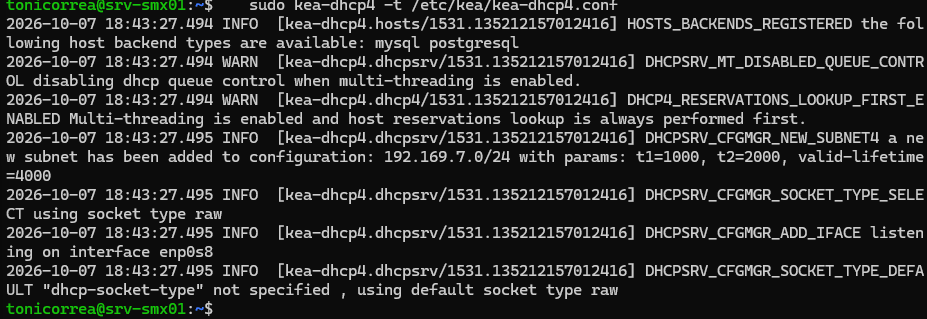

No apareix cap `ERROR` (els `WARN` són avisos normals del multithreading). A la sortida es veu que la configuració s'ha llegit bé: s'ha afegit la subxarxa **192.169.7.0/24** amb els temporitzadors t1=1000, t2=2000 i valid-lifetime=4000, i el servidor escolta a la interfície **enp0s8**.

> **Problema trobat:** la primera vegada que es va comprovar la sintaxi apareixia la subxarxa 192.168.200.0/24 i la interfície enp0s3. Era la configuració de l'arxiu original, perquè l'arxiu nou no s'havia desat bé. Es va solucionar esborrant el `kea-dhcp4.conf` i creant-lo de nou.

Es reinicia el servei i se'n comprova l'estat:

```bash
sudo systemctl restart kea-dhcp4-server
sudo systemctl status kea-dhcp4-server
```

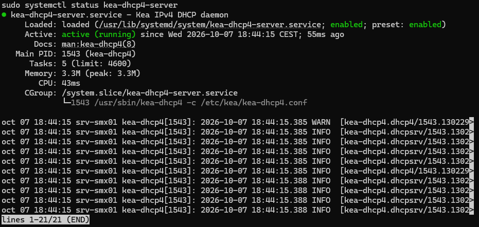

El servei està **active (running)** i s'executa amb l'arxiu `/etc/kea/kea-dhcp4.conf`.

---

## 7. Wireshark al client

Amb el Zorin encara en NAT s'instal·la Wireshark:

```bash
sudo apt install wireshark
```

Durant la instal·lació pregunta si els usuaris sense privilegis poden capturar paquets. S'ha contestat **No**, que és l'opció recomanada per seguretat, ja que Wireshark s'obrirà amb `sudo`.

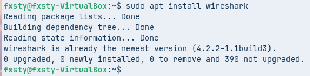

Abans de canviar de xarxa es mira la configuració del Zorin amb `ip a`. La interfície és **enp0s3**, té la IP **10.0.2.15** que dona el NAT de VirtualBox i la seva MAC és **08:00:27:a8:06:a5**:

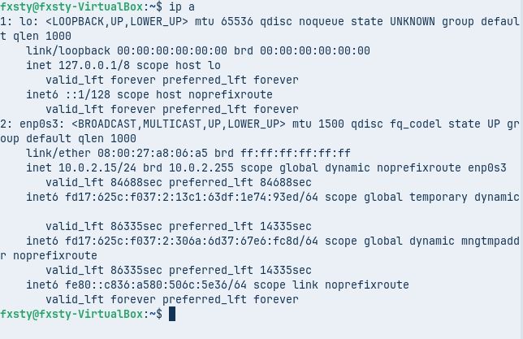

S'obre Wireshark amb `sudo wireshark`:

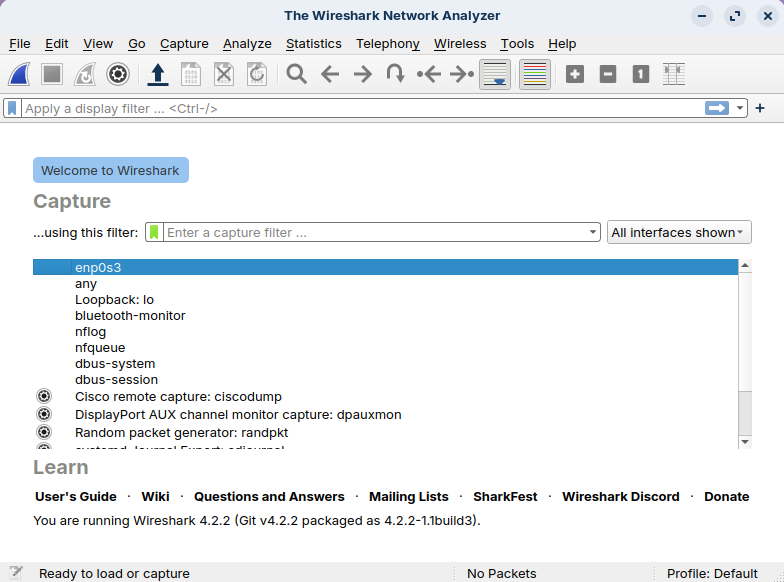

---

## 8. Captura de la negociació DHCP

Se segueix aquest ordre:

1. S'inicia la captura a la interfície **enp0s3** i s'aplica el filtre de visualització `dhcp`.
2. Sense apagar la màquina, es canvia l'adaptador del Zorin de **NAT** a **Xarxa interna** amb el nom `Internet`, el mateix que el servidor:

   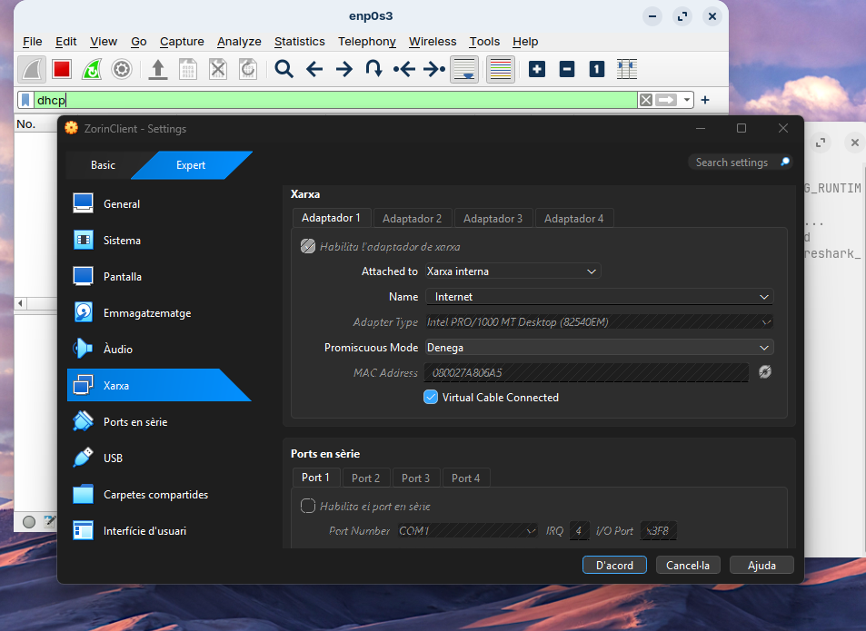

3. Es força la renovació de la IP amb l'eina gràfica: a la configuració de xarxa del Zorin, es desactiva i es torna a activar la connexió per cable.

Resultat de la captura:

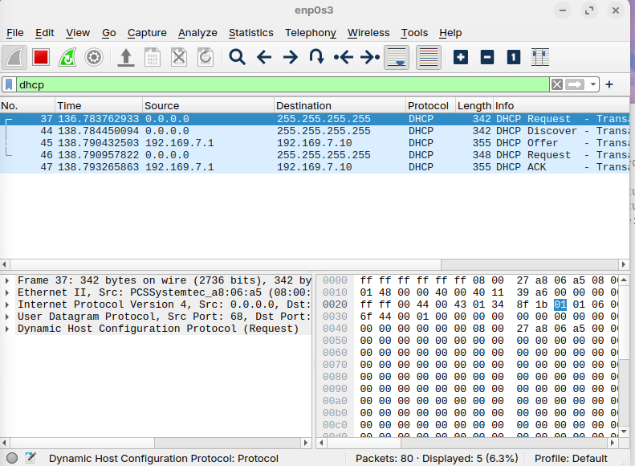

| Núm. | Paquet | IP origen | IP destinació |
|---|---|---|---|
| 37 | DHCP Request | 0.0.0.0 | 255.255.255.255 |
| 44 | DHCP **Discover** | 0.0.0.0 | 255.255.255.255 |
| 45 | DHCP **Offer** | 192.169.7.1 | 192.169.7.10 |
| 46 | DHCP **Request** | 0.0.0.0 | 255.255.255.255 |
| 47 | DHCP **ACK** | 192.169.7.1 | 192.169.7.10 |

Es veu el procés complet **DORA** (Discover, Offer, Request, ACK):

- **Discover:** el client busca un servidor DHCP a la xarxa.
- **Offer:** el servidor li ofereix una IP, la 192.169.7.10, la primera del pool.
- **Request:** el client accepta i demana formalment aquesta IP.
- **ACK:** el servidor confirma la concessió.

El primer paquet (**37**, un Request) apareix abans del Discover perquè el client intenta primer renovar la IP que tenia en NAT (10.0.2.15). El servidor Kea no li contesta, perquè aquesta IP no pertany a la seva subxarxa, i aleshores el client comença el procés normal des del Discover.

---

## 9. Anàlisi dels paquets: broadcast i unicast

Per a cada paquet s'han mirat els apartats **Ethernet II** (adreces MAC) i **Internet Protocol Version 4** (adreces IP).

**Discover (paquet 44):**

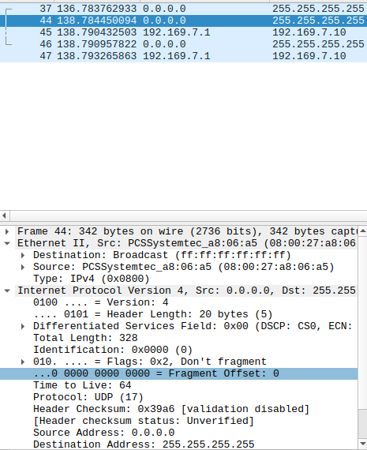

**Offer (paquet 45):**

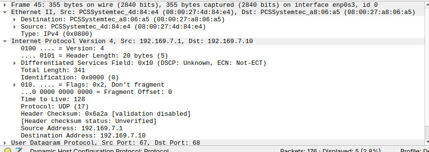

**Request (paquet 46):**

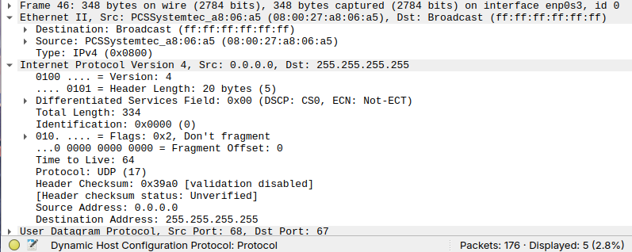

**ACK (paquet 47):**

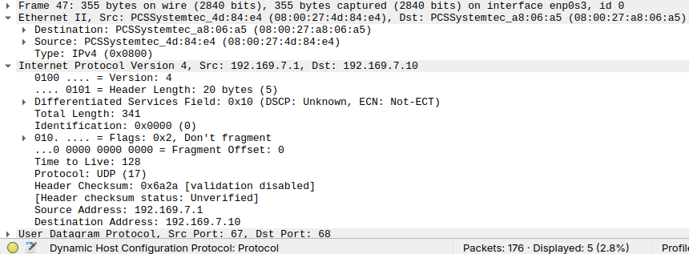

### Resum

| Paquet | MAC origen | MAC destinació | IP origen | IP destinació | Tipus MAC | Tipus IP |
|---|---|---|---|---|---|---|
| Discover | 08:00:27:a8:06:a5 (client) | ff:ff:ff:ff:ff:ff | 0.0.0.0 | 255.255.255.255 | **Broadcast** | **Broadcast** |
| Offer | 08:00:27:4d:84:e4 (servidor) | 08:00:27:a8:06:a5 (client) | 192.169.7.1 | 192.169.7.10 | **Unicast** | **Unicast** |
| Request | 08:00:27:a8:06:a5 (client) | ff:ff:ff:ff:ff:ff | 0.0.0.0 | 255.255.255.255 | **Broadcast** | **Broadcast** |
| ACK | 08:00:27:4d:84:e4 (servidor) | 08:00:27:a8:06:a5 (client) | 192.169.7.1 | 192.169.7.10 | **Unicast** | **Unicast** |

**Explicació:**

- Els paquets que envia el **client** (Discover i Request) són **broadcast**, tant en MAC com en IP. El client encara no té IP (per això fa servir 0.0.0.0 com a origen) i no sap on és el servidor, així que envia el missatge a tots els equips de la xarxa. El Request també va en broadcast perquè, si hi hagués diversos servidors DHCP, tots sàpiguen quina oferta ha acceptat el client.
- Els paquets que envia el **servidor** (Offer i ACK) són **unicast**, tant en MAC com en IP. El servidor ja coneix la MAC del client perquè venia al Discover, així que li respon directament a ell, a la IP que li està oferint.

---

## 10. Comprovació del client

Amb `ip a` i `ip route` es comprova que el Zorin s'ha configurat per DHCP:

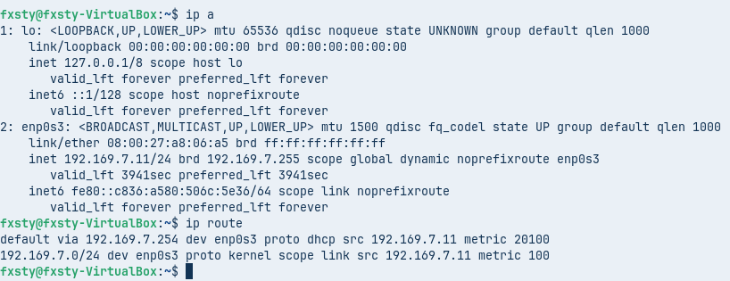

- **IP:** 192.169.7.11/24, dins del pool.
- **Porta d'enllaç:** `default via 192.169.7.254 ... proto dhcp`, rebuda per DHCP.
- **Temps de concessió:** `valid_lft 3941sec`, és a dir, els 4000 segons configurats, que van baixant.

> A la captura de Wireshark el client va rebre la **.10**, però en aquesta comprovació (feta un altre dia, després de reiniciar les màquines) va rebre la **.11**. Kea encara tenia la .10 registrada com a concedida i li va assignar la següent lliure del pool. És un comportament normal i la IP continua estant dins del rang.

Als detalls de la connexió per cable es veuen també el **DNS 8.8.8.8** i la MAC del client:

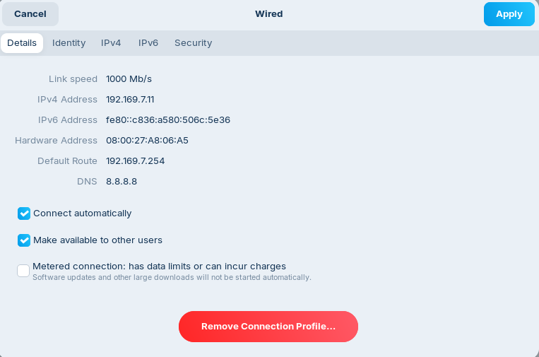

El client **no té accés a Internet**, i és el que s'espera: la porta d'enllaç 192.169.7.254 no existeix a la xarxa interna. La pràctica només demana que el client rebi bé la configuració.

> **Problema trobat:** en encendre només el Zorin, la connexió per cable no es connectava. Era perquè l'Ubuntu Server estava apagat i, a la xarxa interna, és l'únic que reparteix IP. En encendre el servidor, el client va rebre la IP sense problemes.

---

## 11. Concessions del servidor

Les concessions es guarden a l'arxiu indicat a `lease-database`:

```bash
cat /var/lib/kea/kea-leases4.csv
```

> La presentació parla de `/var/lib/kea/dhcp4.leases`, però en aquesta pràctica l'arxiu és `kea-leases4.csv`, perquè és el nom que es va posar al `kea-dhcp4.conf`.

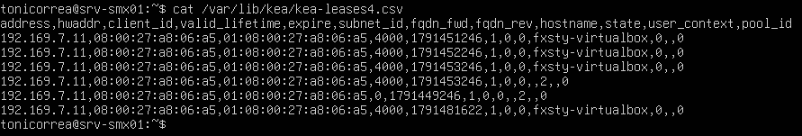

Cada línia és una concessió. Els camps més importants són:

- **address:** la IP concedida, 192.169.7.11.
- **hwaddr:** la MAC del client, 08:00:27:a8:06:a5.
- **valid_lifetime:** la durada, 4000 segons.
- **expire:** quan caduca (en format de temps Unix).
- **subnet_id:** 1, l'`id` de la subxarxa del conf.
- **hostname:** el nom del client, `fxsty-virtualbox`.

La mateixa IP apareix diverses vegades perquè Kea afegeix una línia nova cada vegada que es renova o es modifica la concessió (per exemple, cada vegada que s'ha desactivat i activat la xarxa del client). La línia amb `valid_lifetime` 0 correspon al moment en què el client va alliberar la IP en desconnectar-se.

---

## 12. Reserva d'una IP per al client

Perquè el Zorin rebi sempre la mateixa IP, es crea una **reserva** amb la seva MAC (`08:00:27:a8:06:a5`) i la IP **192.169.7.55**. La reserva es posa dins del bloc de la subxarxa, però **fora del pool** (la .55 no és entre la .10 i la .50), per evitar conflictes amb les IP que es reparteixen de manera dinàmica.

```json
"pools": [ { "pool": "192.169.7.10 - 192.169.7.50" } ],
"reservations": [
  { "hw-address": "08:00:27:a8:06:a5", "ip-address": "192.169.7.55" }
],
```

En afegir la reserva, cal posar una **coma** després del `]` de `pools`, perquè ja no és l'últim element del bloc.

Arxiu complet amb la reserva:

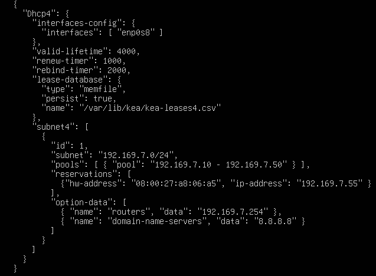

Es comprova la sintaxi, es reinicia el servei i es verifica que està en marxa:

```bash
sudo kea-dhcp4 -t /etc/kea/kea-dhcp4.conf
sudo systemctl restart kea-dhcp4-server
sudo systemctl status kea-dhcp4-server
```

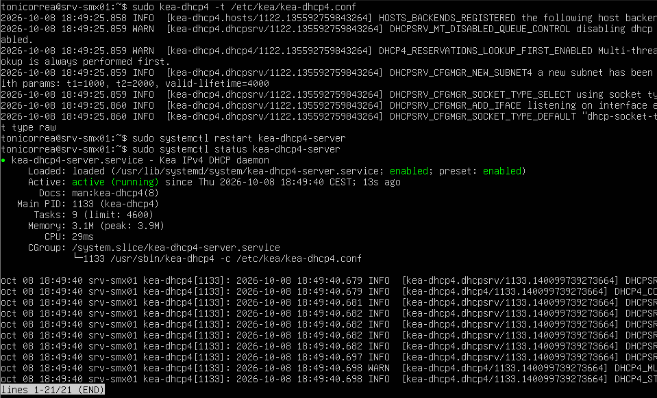

Al Zorin es desactiva i es torna a activar la connexió de xarxa perquè demani de nou la IP. Ara rep la **192.169.7.55**, la IP reservada:

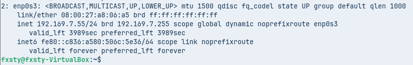

---

## 13. Conclusions

- S'ha instal·lat i configurat un servidor DHCP amb **Kea** a Ubuntu Server, que reparteix IP, porta d'enllaç i DNS als clients de la xarxa interna 192.169.7.0/24.
- Amb **Wireshark** s'ha capturat el procés **DORA** i s'ha comprovat que els missatges del client (Discover i Request) són **broadcast** i els del servidor (Offer i ACK) són **unicast**, tant a nivell de MAC com d'IP.
- Amb una **reserva** es pot assignar sempre la mateixa IP a un equip concret a partir de la seva MAC.
- Quan es treballa amb l'arxiu JSON de Kea és molt important revisar les claus, els claudàtors i les comes, i comprovar sempre la sintaxi amb `kea-dhcp4 -t` abans de reiniciar el servei.